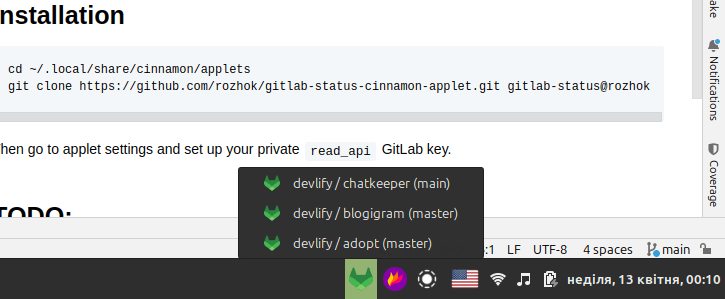

# gitlab-status-cinnamon-applet
Cinnamon applet for displaying GitLab pipeline statuses.

Tray icon shows aggregated status of pipelines run in the last two days:
- Red: any pipeline has failed
- Blue: there are running pipelines, but no failed pipelines
- Green: all pipelines succeeded
- Gray: no pipelines were run in the last two days



## Installation

```
cd ~/.local/share/cinnamon/applets 
git clone https://github.com/rozhok/gitlab-status-cinnamon-applet.git gitlab-status@rozhok
```

Then go to applet settings and set up your private `read_api` GitLab key.

## TODO:
- Error handling
- Projects selection
- GitHub support
- Customize pipelines creation date